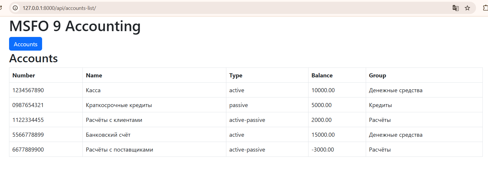
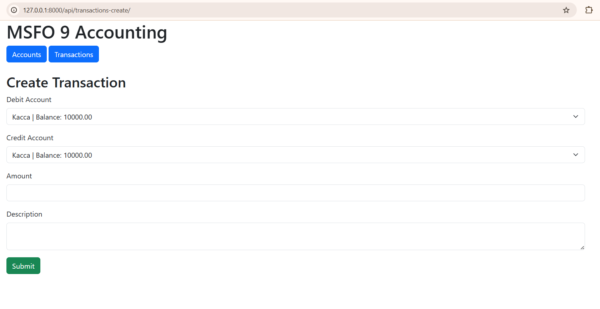
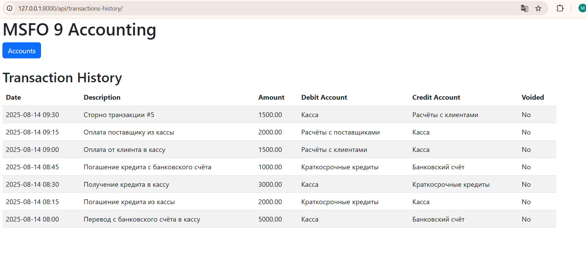

# Скачивание проекта:

1) Создайте папку на рабочем столе
2) Откройте ее через Git console
3) Введите команду:
   git clone https://github.com/GolumnOP/financial.git

# Запуск проекта:

1) Создание и активация виртуального окружения:
    python -m venv .venv
    .venv\Scripts\activate

2) Установка зависимостей
    pip install -r requirements.txt

3) Создание и применение миграций:
    python manage.py makemigrations
    python manage.py migrate

4) Загрузка фикстур:
    python manage.py loaddata test_data.json

5) Создание админа
    python manage.py createsuperuser ('enter','enter',123)

6) Запуск тестов
    pytest .

# Endpoints:

1) Интерфейс Списка Транзакций:
    http://127.0.0.1:8000/api/accounts-list/

2) Создание транзакции:
    http://127.0.0.1:8000/api/transactions-create/    

3) История транзакций:
    http://127.0.0.1:8000/api/transactions-history/

4) Swagger doc:
    http://127.0.0.1:8000/schema/swagger-ui/#/